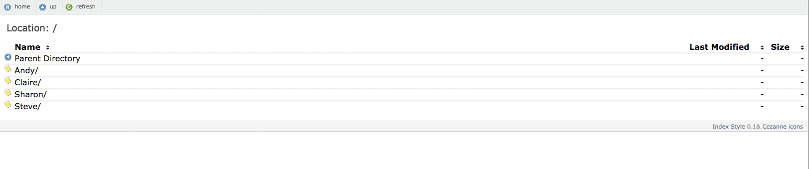

Create nice directory listings for s3 buckets using only javascript and HTML.

The listing can be deployed on any site and can also be deployed into a bucket.



## Usage

1. Edit the index.html file and modify the BUCKET_URL variable to point to your S3 bucket, e.g. http://wvcc-product-bucket.s3.amazonaws.com.

2. Upload the index-style/ folder, index.html and list.js to your bucket. For the index.html and list.js files, click on both files in the S3 dashboard, click on "Properties", and view the "Metadata".
  - For index.html, make sure key `Content-Type` has a value of `text/html`.
  - For list.js, key `Content-Type` should have a value of `application/javascript`.

3. Enable website hosting under `Static website hosting` in your S3 bucket settings.
  - Enter `index.html` as your `Index Document` and `Error Document`.

4. Edit the bucket policy. Below are different configurations depending on the use case. Copy the appropriate one onto your bucket policy, making sure to update the "Resource" ARN value to point to the target s3 bucket.

  - To allow public access by setting public access in the ACL use following policy:

```
{
    "Version": "2012-10-17",
    "Statement": [
        {
            "Sid": "AddPerm",
            "Effect": "Allow",
            "Principal": "*",
            "Action": [
                "s3:ListBucket"
            ],
            "Resource": [
                "arn:aws:s3:::<Bucket Name>"
            ]
        },
        {
            "Sid": "AddPerm",
            "Effect": "Allow",
            "Principal": "*",
            "Action": [
                "s3:GetObject"
            ],
            "Resource": [
                "arn:aws:s3:::<Bucket Name>/*"
            ]
        }
    ]
}
```


  

  - To restrict to a IP address or subnet only:
  
```
{
    "Version": "2012-10-17",
    "Statement": [
        {
            "Sid": "AddPerm",
            "Effect": "Allow",
            "Principal": "*",
            "Action": [
                "s3:ListBucket"
            ],
            "Resource": [
                "arn:aws:s3:::<Bucket Name>"
            ],
            "Condition": {
                "IpAddress": {
                    "aws:SourceIp": [
                        "<subnet>/16",
                        "<subnet>/16",
                        "<subnet>/16"
                    ]
                }
            }
        },
        {
            "Sid": "AddPerm",
            "Effect": "Allow",
            "Principal": "*",
            "Action": [
                "s3:GetObject"
            ],
            "Resource": [
                "arn:aws:s3:::<Bucket Name>/*"
            ],
            "Condition": {
                "IpAddress": {
                    "aws:SourceIp": [
                        "<subnet>/16",
                        "<subnet>/16",
                        "<subnet>/16"
                    ]
                }
            }
        }
    ]
}
```
 
 
 - Assign the following CORS policy

```
<CORSConfiguration>
 <CORSRule>
   <AllowedOrigin>*</AllowedOrigin>
   <AllowedMethod>GET</AllowedMethod>
   <AllowedHeader>*</AllowedHeader>
 </CORSRule>
</CORSConfiguration>
```
  
5. Navigate to _`http://BUCKET.s3-website-REGION.amazonaws.com`_ to access the script. The _`-website-`_ in the URL is important, as the non-website URL is what serves your XML Bucket List.

  <http://docs.aws.amazon.com/AmazonS3/latest/dev/WebsiteEndpoints.html#WebsiteRestEndpointDiff>

  A specific example for the EU west region:
  - Website endpoint: _`http://example-bucket.s3-website-eu-west-1.amazonaws.com/`_
  - S3 bucket endpoint (for RESTful calls): _`http://example-bucket.s3-eu-west-1.amazonaws.com/`_

  Note that US east region is **different** in that the S3 bucket endpoint does not include a location spec but the website version does:
  - Website endpoint: _`http://example-bucket.s3-website-us-east-1.amazonaws.com/`_
  - S3 bucket endpoint (for RESTful calls): _`http://example-bucket.s3.amazonaws.com/`_
